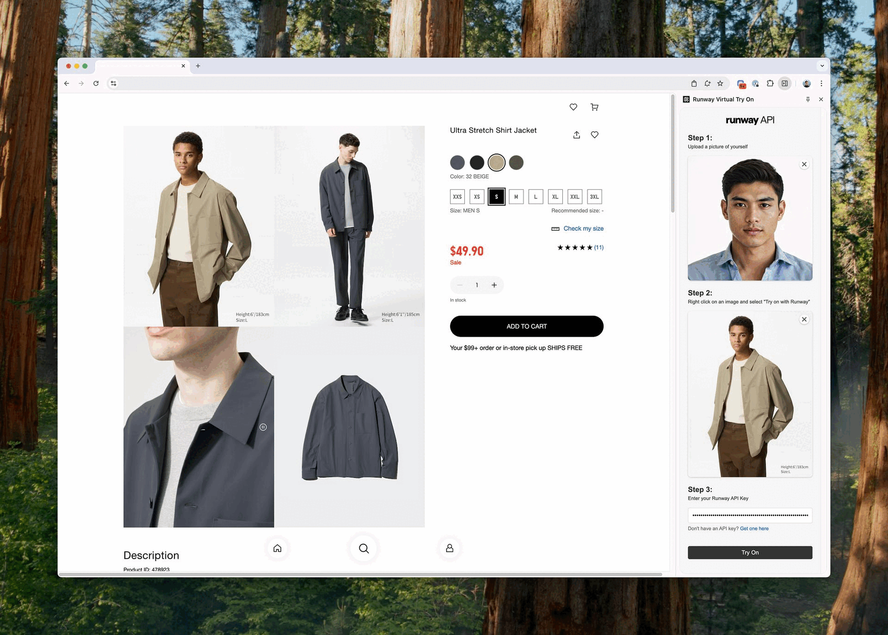

[](demo-gif.gif)

# Runway API Try On Chrome Extension

This Chrome extension connects to the Gen-4 Image API, allowing you to virtually try on clothing by uploading reference images of both yourself and desired outfits.

## Installation

1.  **Clone the repository:**
    ```bash
    git clone https://github.com/your-username/try-on-chrome-extension.git
    ```
2.  **Open Chrome Extensions:**
    Open Google Chrome and navigate to `chrome://extensions`.
3.  **Enable Developer Mode:**
    In the top right corner of the Extensions page, toggle the **Developer mode** switch to the **on** position.
4.  **Load Unpacked Extension:**
    Click the **Load unpacked** button that appears.
    Navigate to the directory where you cloned the repository and select the `extension` folder.

The extension will now be installed and visible in your Chrome extensions list.

## Obtaining a Runway API Key

To use the image generation features, you will need a [Runway API account](https://dev.runwayml.com/), key, and credits. Set this up by following the [Runway API Quickstart](https://docs.dev.runwayml.com/guides/using-the-api/) guide.

## Learn More

- [Runway API Documentation](https://docs.runwayml.com/docs/overview)
